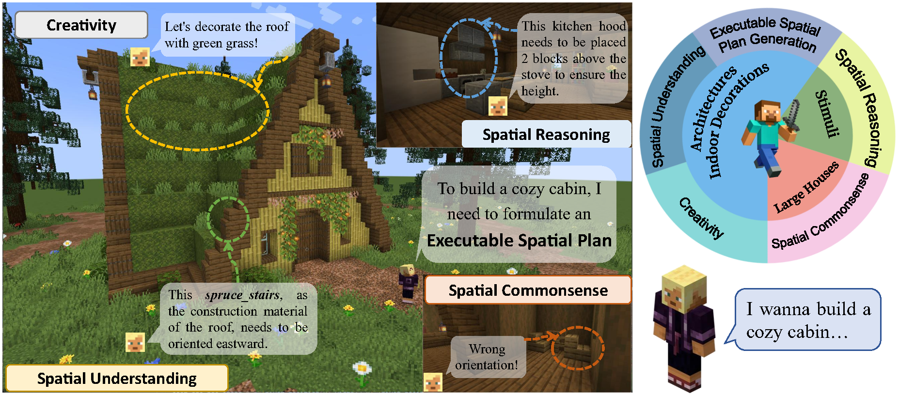

<div align="center">
<h2 align="center">
   <b>MineAnyBuild: Benchmarking Spatial Planning for Open-world AI Agents
   <!-- <br /> <font size=3>Under Review</font></b>  -->
</h2>
<div>
<a href="http://sadil13.github.io/" target="_blank">Ziming&#160;Wei</a><sup>1*</sup>,
<a href="https://expectorlin.github.io/" target="_blank">Bingqian&#160;Lin</a><sup>2*</sup>,
<a href="https://openreview.net/profile?id=~Zijian_Jiao1" target="_blank">Zijian&#160;Jiao</a><sup>1*</sup>,
<a href="https://scholar.google.com/citations?user=jV19-sIAAAAJ" target="_blank">Yunshuang&#160;Nie</a><sup>1</sup>,
<a href="https://scholar.google.com/citations?user=tHRExZ8AAAAJ" target="_blank">Liang&#160;Ma</a><sup>3</sup>,
<br>
<a href="https://openreview.net/profile?id=~Yuecheng_Liu1" target="_blank">Yuecheng&#160;Liu</a><sup>4</sup>,
<a href="https://scholar.google.com/citations?user=ny9KAREAAAAJ" target="_blank">Yuzheng&#160;Zhuang</a><sup>4</sup>,
<a target="_blank" href="https://scholar.google.com/citations?user=voxznZAAAAAJ">Xiaodan&#160;Liang</a><sup>1&#9993</sup>
</div>
<sup>1</sup>Shenzhen Campus of Sun Yat-Sen University,&#160;
<sup>2</sup>Shanghai Jiao Tong University,&#160;
<br>
<sup>3</sup>Mohamed bin Zayed University of Artificial Intelligence,&#160;
<sup>4</sup>Huawei Noah’s Ark Lab
<br />
<sup>*&#160;</sup>Equal contribution&#160;&#160;</span>
<sup>&#9993&#160;</sup>Corresponding author&#160;&#160;</span>
<br/>
<div align="center">
    <a href="https://arxiv.org/abs/2505.20148" target="_blank">
    </a>
</div>
</div>

______________________________________________________________________

<font size=2>
Spatial Planning is a crucial part in the field of spatial intelligence, which requires the understanding and planning about object arrangements in space perspective. AI agents with the spatial planning ability can better adapt to various real-world applications, including robotic manipulation, automatic assembly, urban planning <i>etc</i>.  Recent works have attempted to construct benchmarks for evaluating the spatial intelligence of Multimodal Large Language Models (MLLMs). Nevertheless, these benchmarks primarily focus on spatial reasoning based on typical Visual Question-Answering (VQA) forms, which suffers from the gap between abstract spatial understanding and concrete task execution. In this work, we take a step further to build a comprehensive benchmark called <b>MineAnyBuild</b>, aiming to evaluate the spatial planning ability of open-world AI agents in the <i>Minecraft</i> game. Specifically, MineAnyBuild requires an agent to generate <i>executable architecture building plans</i> based on the given multi-modal human instructions. It involves 4,000 curated spatial planning tasks and also provides a paradigm for infinitely expandable data collection by utilizing rich player-generated content. MineAnyBuild evaluates spatial planning through four core supporting dimensions: spatial understanding, spatial reasoning, creativity, and spatial commonsense. Based on MineAnyBuild, we perform a comprehensive evaluation for existing MLLM-based agents, revealing the severe limitations but enormous potential in their spatial planning abilities. We believe our MineAnyBuild will open new avenues for the evaluation of spatial intelligence and help promote further development for open-world AI agents capable of spatial planning.</font>




## 📰 Updates
- [05/2025] [Arxiv paper](https://arxiv.org/abs/2505.20148) released.


## 🚨 TODOs (Urgency, To-be-completed in two weeks / June 2025)
- [ ] Remaining codes for evaluation of MLLM-based agents
- [ ] Remaining codes for data curation
- [ ] Remaining codes for inference of MLLM-based agents


## ✅ TODOs (Future, in several months)

- [ ] Docs of instructions for Replay Mod (June 2025)
- [ ] RL environment codes for Mineflayer (June~July 2025)
- [ ] Fix known bugs
- [ ] Debugging and provide adaptation to normal python codes (except for Jupyter notebook)
- [ ] MineRL/MineDojo codes (in several months)


______________________________________________________________________


# Contents
- [Contents](#contents)
- [Installation](#installation)
  - [Install Minecraft](#install-minecraft)
  - [Install packages](#install-packages)
  - [Create a Conda env and packages](#create-a-conda-env-and-packages)
- [Running codes](#running-codes)
  - [Evaluation](#evaluation)
    - [Executable Spatial Plan Generation, Creativity and Spatial Understanding tasks](#executable-spatial-plan-generation-creativity-and-spatial-understanding-tasks)
    - [Spatial Reasoning tasks](#spatial-reasoning-tasks)
    - [Spatial Commonsense tasks](#spatial-commonsense-tasks)
  - [Data curation](#data-curation)
    - [Autonomous Generation](#autonomous-generation)
    - [Instruction Generation](#instruction-generation)
  - [Inference of MLLM-based agents](#inference-of-mllm-based-agents)
    - [Proprietary MLLMs](#proprietary-mllms)
    - [Open-source MLLMs](#open-source-mllms)
- [Citation](#citation)
- [Acknowledgement](#acknowledgement)


# Installation

## Install Minecraft

Ensure you have a valid Microsoft account and Minecraft JAVA Edition.

1. Visit the [Minecraft Official Website](https://www.minecraft.net/en-us) and navigate to the "Get Minecraft" section.
2. Select your platform (Windows, Linux or macOS) and choose **JAVA Edition**.
3. Download the launcher and install it, and then log in using your Microsoft account.
4. Start the launcher, select the release version (1.20.4) compatible with Mineflayer and click **Play** to load the game.
5. Load the test environment map we provide (recommanded) or create a new world with settings.
6. Open the **Pause Menu**, click the **Open to LAN**, and following the settings:
     - Take note of the **Port Number** displayed (in the lower versions of Minecraft) or enter a **Port Number** that is consistent with the code (in the latest versions of Minecraft).
     - Set the game mode to **Creative**.
     - [IMPORTANT] Enable **Cheats** to allow command usage required for MLLM-based agents.

For more detailed instructions, visit the [Minecraft Help Center](https://help.minecraft.net/hc/en-us) for help.


## Install packages

1. Download and install the appropriate version of [Node.js](https://nodejs.org/en).
2. Run the following command to install [Mineflayer](https://github.com/PrismarineJS/mineflayer) on your terminal:
```
npm install mineflayer
```

## Create a Conda env and packages

```
conda create -n mineflayer python=3.10
conda activate mineflayer
pip install javascript
```


# Running codes
(We will supplement the following content based on the subsequent code releases in two weeks.)
## Evaluation

### Executable Spatial Plan Generation, Creativity and Spatial Understanding tasks


### Spatial Reasoning tasks


### Spatial Commonsense tasks


## Data curation

### Autonomous Generation


### Instruction Generation


## Inference of MLLM-based agents

### Proprietary MLLMs


### Open-source MLLMs


# Citation
If you find this work useful, please consider citing:
```bibtex
@misc{wei2025mineanybuildbenchmarkingspatialplanning,
      title={MineAnyBuild: Benchmarking Spatial Planning for Open-world AI Agents}, 
      author={Ziming Wei and Bingqian Lin and Zijian Jiao and Yunshuang Nie and Liang Ma and Yuecheng Liu and Yuzheng Zhuang and Xiaodan Liang},
      year={2025},
      eprint={2505.20148},
      archivePrefix={arXiv},
      primaryClass={cs.AI},
      url={https://arxiv.org/abs/2505.20148}, 
}
```

# Acknowledgement
Some of the codes are built upon [APT](https://github.com/spearsheep/APT-Architectural-Planning-LLM-Agent). Thanks them for their great works!